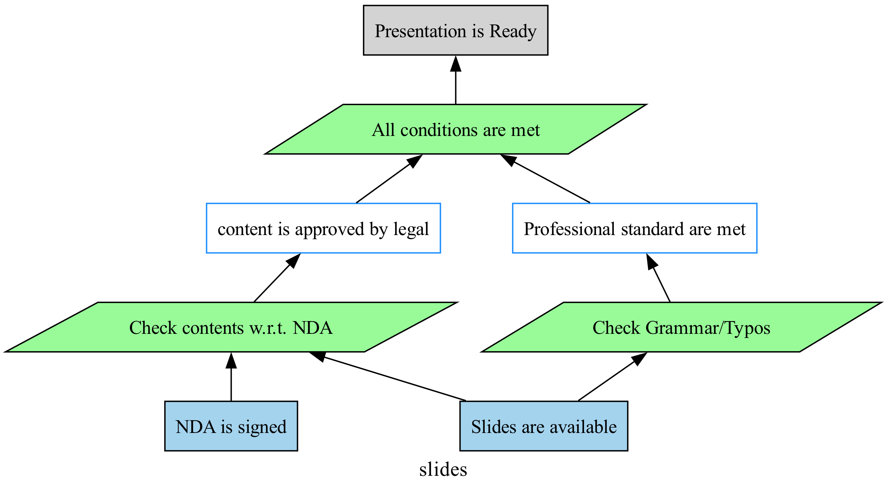

# jPipe Runner

```text
     _ ____  _               ____                              
   (_)  _ \(_)_ __   ___   |  _ \ _   _ _ __  _ __   ___ _ __ 
   | | |_) | | '_ \ / _ \  | |_) | | | | '_ \| '_ \ / _ \ '__|
   | |  __/| | |_) |  __/  |  _ <| |_| | | | | | | |  __/ |   
  _/ |_|   |_| .__/ \___|  |_| \_\\__,_|_| |_|_| |_|\___|_|   
 |__/        |_|                                              
```

A Justification Runner designed for jPipe.

## Motivation

In the current Justification Diagram of [jPipe](https://github.com/ace-design/jpipe), the primary focus is on describing
_what justification_ to perform and the _reasoning relationship_ between justification and conclusion. However, it does
not elaborate on _how_ to actually execute these justifications in code, resulting in .jd files that are mainly a visual
representation of reasoning — **lacking the capacity to run the justification process** in practice.

In contrast, [Robot Framework](https://github.com/robotframework/robotframework) is a generic automation framework for
acceptance testing. It uses a simple plain-text syntax and can be extended with various libraries.

- It maps the "keyword" that appears in the test case to a Python (or other language) function for execution.
- This allows the "verification function" to be called directly when writing the test script and get the execution
  result (Pass/Fail), thus enabling an executable test/verification process.

**Inspired by Robot Framework's keyword-driven approach**, we propose to implement a jpipe-runner to make the jPipe
Justification Diagram executable and operational. With this extension, each _justification evidence/strategy_ could be
mapped to corresponding executable code, transforming jPipe from a purely visual reasoning tool into a fully automated
CI/CD-style justification framework.

## Features

- Fully compatible with existing jPipe syntax/grammar.
    - Support `load`, `justification`, `pattern`, and `composition`.
- A keyword-driven operational justification diagram framework.

## Repository organization

- `examples`: examples of models, images, and libraries
- `jpipe_runner`: Python source code of the jPipe runner

## Installation

jPipe Runner requires:

- Python (version 3.12 or later)
- [Graphviz](https://www.graphviz.org/) (version 2.46 or later)
- C/C++ Compiler

> [!NOTE]
> These instructions assume you have Python, Graphviz and a C/C++ Compiler on your computer.

### Pip

```shell
$ pip install -U git+https://github.com/ace-design/jpipe-runner.git@main
```

### Docker

We currently do not provide jpipe-runner images on the public registry, so you will need to build it yourself.

```shell
$ docker build -t jpipe-runner:latest .
```

### Actions

Alternatively, you can simply integrate jpipe runner into your actions.

```yaml
steps:
  - uses: ace-design/jpipe-runner@main
    with:
      jd_file: "/path/to/your/justification.jd"
      variable: |
        key:value
      library: |
        path/to/libraries/*.py
      diagram: "*"
      dry_run: false
```

## Examples

Consider this justification diagram: It has two pieces of evidence supporting two strategies; these strategies support
each sub-conclusion, which further supports the final strategy, and then reaches the conclusion.



To justify this diagram, we can map each evidence/strategy to a Python function, and the jpipe runner will call the
corresponding function based on the order of justification, i.e. evidence -> strategy, and only if that function returns
a non-false result, the justification process will proceed.

For example, consider the following Python demo code:

```python
signature = None
available = None

cons = []

def nda_is_signed():
    return signature == 'jason'

def slides_are_available():
    return available

def check_contents_wrt_nda():
    x = "ok"
    cons.append(x)
    return x

def check_grammar_typos():
    x = "loos good!"
    cons.append(x)
    return x

def all_conditions_are_met():
    return all(cons)
```

Run the justification with jpipe runner:

```shell
python -m jpipe_runner \
  -l 'examples/libraries/slides.py' \
  -v signature:jason \
  -v available:ready \
  examples/models/01_slides.jd
```

The runner output is as follows:

```text
==============================================================================
jPipe Files                                                               
==============================================================================
jPipe Files.Justification :: slides                                       
==============================================================================
Evidence<nda> :: NDA is signed                                        | PASS |
------------------------------------------------------------------------------
Evidence<available> :: Slides are available                           | PASS |
------------------------------------------------------------------------------
Strategy<grammar> :: Check Grammar/Typos                              | PASS |
------------------------------------------------------------------------------
Strategy<compliant> :: Check contents w.r.t. NDA                      | PASS |
------------------------------------------------------------------------------
Sub-Conclusion<decent> :: Professional standard are met               | PASS |
------------------------------------------------------------------------------
Sub-Conclusion<legal> :: content is approved by legal                 | PASS |
------------------------------------------------------------------------------
Strategy<all> :: All conditions are met                               | PASS |
------------------------------------------------------------------------------
Conclusion<ready> :: Presentation is Ready                            | PASS |
------------------------------------------------------------------------------
jPipe Files
1 justification, 1 passed, 0 failed, 0 skipped
==============================================================================
```

_If any step (evidence/strategy) fails during the justification process, the remaining steps will be skipped and the
entire justification will fail._

## How to cite?

```bibtex
@software{mcscert:jpipe-runner,
  author = {Mosser, Sébastien and Lyu, Jason},
  license = {MIT},
  title = {{jPipe Runner}},
  url = {https://github.com/ace-design/jpipe-runner}
}
```

## How to contribute?

Found a bug, or want to add a cool feature? Feel free to fork this repository and send a pull request.

If you're interested in contributing to the research effort related to jPipe projects, feel free to contact the PI:

- [Dr. Sébastien Mosser](mailto:mossers@mcmaster.ca)
